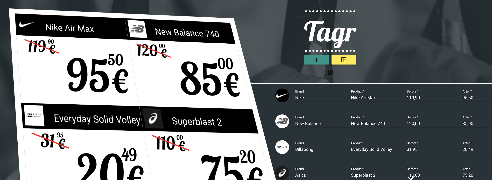

> Generate printable sales tags for your clothing retail store!

**Tagr** generates printable price tags for retail stores by allowing users to input product and brand details. It automatically fetches brand logos via an API and composes ready-to-print tags with the relevant information.

Live version at [tagr.onerender.com](https://tagr.onerender.com) It might take
1-2 minutes to deploy the server. In order to save money after inactivity the
server will shut down.

## Stack

`MEAN` stack project (Mongo, Express, Angular, Node.js).

- `MongoDB` & `Mongoose` for database management
- `Node.js` environment for gluing everything.
- `Angular` for the client side logic and MVC operations
- `Express` for serving and server side logic
- `Passport` for authentication
- `Stylus` for site styling
- `Jade/Pug` for HTML templating
- `Gulp` as task runner
